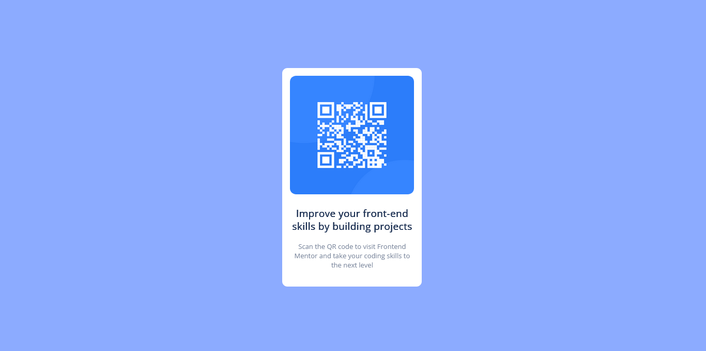

# Frontend Mentor - QR code component solution

This is a solution to the [QR code component challenge on Frontend Mentor](https://www.frontendmentor.io/challenges/qr-code-component-iux_sIO_H). Frontend Mentor challenges help you improve your coding skills by building realistic projects. 

## Table of contents

- [Overview](#overview)
  - [Screenshot](#screenshot)
  - [Links](#links)
- [My process](#my-process)
  - [Built with](#built-with)
  - [What I learned](#what-i-learned)
  - [Continued development](#continued-development)
  - [Useful resources](#useful-resources)
- [Author](#author)
- [Acknowledgments](#acknowledgments)


## Overview

### Screenshot




### Links

- Solution URL: [Add solution URL here](https://your-solution-url.com)
- Live Site URL: [Add live site URL here](https://your-live-site-url.com)

## My process

### Built with

- Semantic HTML5 markup
- CSS custom properties
- Flexbox
- CSS Grid


### What I learned
To see how you can add code snippets, see below:

```html
<h1>Some HTML code I'm proud of</h1>
```
```css
.css{
color: hsl(218, 48%, 22%);
}
```


### Continued development

Areas i am not still comfortable with as of this point.
-Display
-Flexbox
-Position


### Useful resources

- [Resource 1](https://www.w3schools.com/html/html_intro.asp) - This website has helped and will continue to help me understand HTML as a whole.

- [Resource 2](https://www.TikTok.com) - i was able to gain useful help with the videos people post on this platform. I'd recommend it to anyone still learning this concept.


## Author

- Frontend Mentor - [@andikeme]( https://www.frontendmentor.io/profile/andikeme)
- Twitter - [@ds98958](https://www.twitter.com/ds98958)


## Acknowledgments

Thanks to my friend Zulaihat Salihu in helping me sort out some errors i encountered while trying to complete this QR code project.